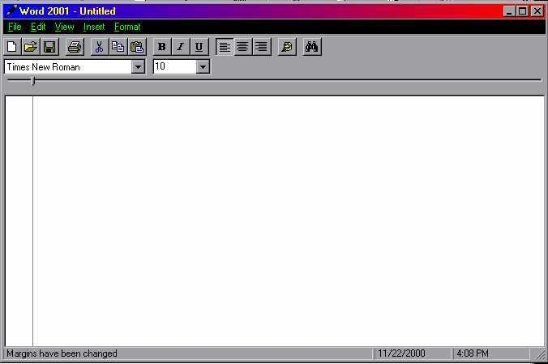



## Word 2001 A complete text editor\!

### Description

Complete Text editor with margins, print options, open, new, save, saveas, clipboard controls, view settings, auto save options, Insert Date/time, styles, alignments, scripts, quick color changes, case changes and more! There shouldn't be any bugs, but if you find any please tell me! Thanks!
 
### More Info
 

             |
---                |---
**Submitted On**   |2000-11-22 16:06:32
**By**             |[Wåzerface](https://github.com/Planet-Source-Code/PSCIndex/blob/master/ByAuthor/w-zerface.md)
**Level**          |Advanced
**User Rating**    |4.7 (47 globes from 10 users)
**Compatibility**  |VB 5\.0, VB 6\.0
**Category**       |[Complete Applications](https://github.com/Planet-Source-Code/PSCIndex/blob/master/ByCategory/complete-applications__1-27.md)
**World**          |[Visual Basic](https://github.com/Planet-Source-Code/PSCIndex/blob/master/ByWorld/visual-basic.md)
**Archive File**   |[CODE\_UPLOAD1194511222000\.zip](https://github.com/Planet-Source-Code/w-zerface-word-2001-a-complete-text-editor__1-13025/archive/master.zip)

